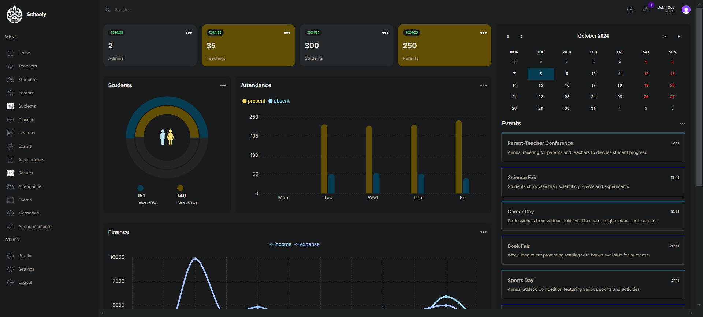
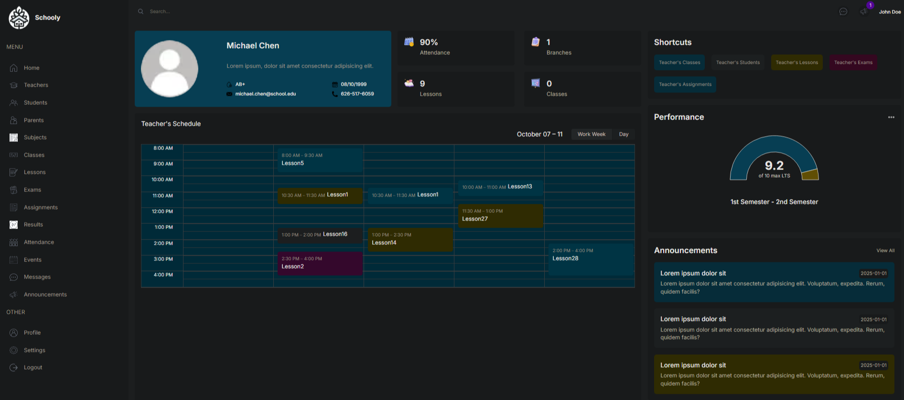
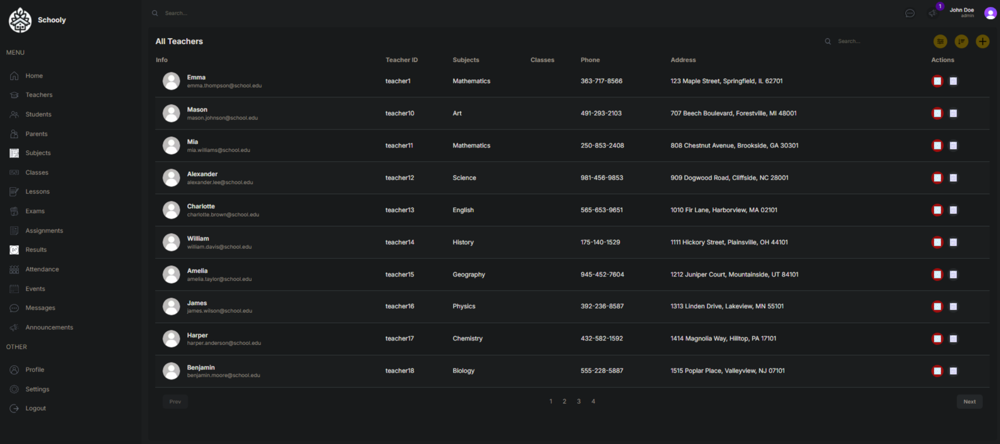

# School Management System

This project is a comprehensive School Management System designed to streamline administrative tasks, enhance communication, and improve overall efficiency in educational institutions.

## Features

- User Management (Admin, Teachers, Students, Parents)
- Dashboard with key metrics and notifications
- Class and Grade Management
- Subject and Lesson Scheduling
- Attendance Tracking
- Exam and Assignment Management
- Result Recording and Reporting
- Event Planning and Announcements
- Parent-Teacher Communication

## Screenshots


*Dashboard view showing key metrics and notifications*


*Weekly class schedule for students and teachers*


*List view of Entities*

## Getting Started

### Prerequisites

- Node.js
- Next.js
- PostgreSQL
- Prisma CLI
- Clerk Authentication
- Cloudinary

### Installation

1. Clone the repository:
   ```
   git clone https://github.com/nishorgo/schooly.git
   ```

2. Install dependencies:
   ```
   cd school-management-system
   npm install
   ```

3. Set up the database:
   ```
   npx prisma migrate dev
   ```

4. Seed the database:
   ```
   npx prisma db seed
   ```

5. Start the development server:
   ```
   npm run dev
   ```

## Technologies Used

- Next.js
- Prisma ORM
- PostgreSQL
- TypeScript
- React
- Tailwind CSS
- Clerk Authentication

## Contributing

Contributions are welcome! Please feel free to submit a Pull Request.

## License

This project is licensed under the MIT License - see the [LICENSE](LICENSE) file for details.

## Acknowledgments

- Thanks to all contributors who have helped shape this project.
- Special thanks to the open-source community for providing excellent tools and libraries.
